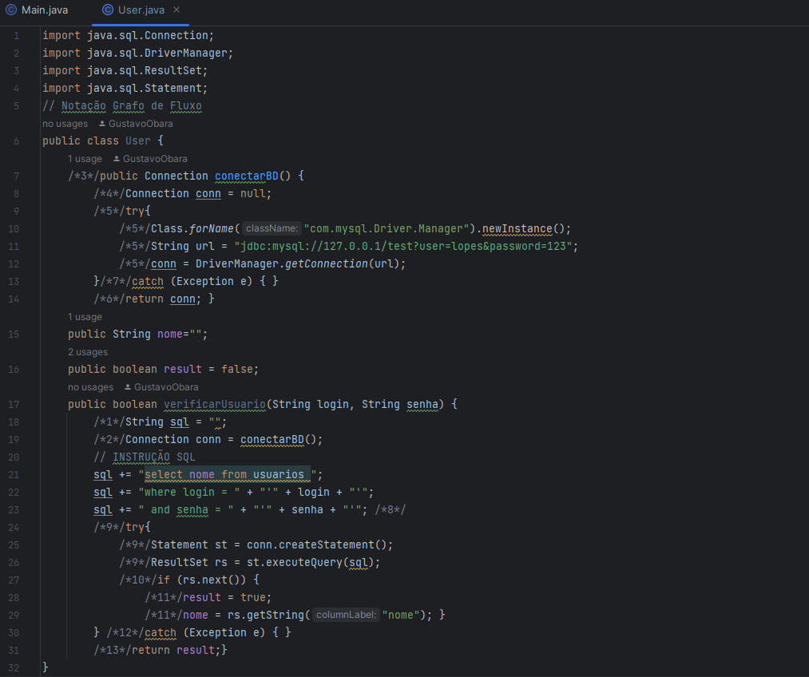
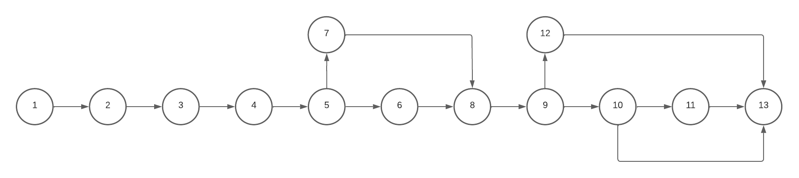

# TESTE DE CAIXA BRANCA - QUALIDADE E TESTES DE SOFTWARE
# DESCRIÇÃO DA ATIVIDADE
Nesta atividade, foi explorando a técnica de teste de caixa-branca, também conhecida como teste estrutural ou teste de caixa de vidro. Apontando alguns possíveis erros contidos no código.
# POSSÍVEIS ERROS

<hr>

### A DOCUMENTAÇÃO FOI DESCRITA NO CÓDIGO?
o código não possui comentários ou documentação que explique o que cada parte do código está fazendo.
<hr>

### AS VARIÁVEIS E CONSTANTES POSSUEM BOA NOMENCLATURA?
As variáveis neste código têm nomes pouco descritivos e não seguem as melhores práticas de nomenclatura Java. Por exemplo, a variável 'nome' poderia ser renomeada para algo mais descritivo, como nomeUsuario. Além disso, a variável result não fornece informações claras sobre o que ela representa, e seria melhor nomeá-la de forma mais descritiva,
<hr>

### EXISTEM LEGIBILIDADE E ORGANIZAÇÃO NO CÓDIGO?
A formatação do código é inconsistente, fazendo com que fique mais díficil de entender.
<hr>

### AS CONEXÕES UTILIZADAS FORAM FECHADAS?
Não, o código não fecha as conexões do banco de dados após o uso.
<hr>

### TODOS OS NULLPOINTERS FORAM TRATADOS?
Não, existe um `Try/Catch` no código mas o `Catch` está vazio, não tratando demais erros.

<hr>

### Notação de Grafo de Fluxo
Nessa segunda etapa da atividade, foi estudado a notação de grafo, ferramenta usada para representar o fluxo de controle lógico. Dessa
forma, é possível representar um fluxograma de controle do programa em um grafo de fluxo
correspondente:
<ul>
  <li>O grafo de fluxo mostra o fluxo de controle</li>
  <li>Nós representam um ou mais processos</li>
  <li>Arestas representam o fluxo de controle</li>
  <li>Regiões do grafo são áreas limitadas pelas arestas e nós (incluindo a área fora do grafo)</li>
</ul>

### Indentificação dos pontos de extração



### Criação do Grafo


```
E = Número de Arestas
N = Número de Nós do Grafo

E = 15
N = 13
V(G) = (E - N) + 2
V(G) = (15 - 13) + 2
V(G) = 2 + 2
V(G) = 4
COMPLEXIDADE CICLOMÁTICA = 4
```
Com o calculo da Complexidade ciclomática e a Criação do Grafo, é possível identificar os seguintes caminhos independentes:

1. `1-2-3-4-5-6-8-9-10-11-13`
2. `1-2-3-4-5-7-8-9-10-11-13`
3. `1-2-3-4-5-6-8-9-12-13`
4. `1-2-3-4-5-7-8-9-12-13`

# Última atualização - 06/10/2023
